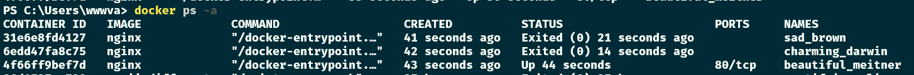
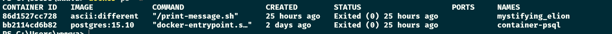

# Exercise 1.1: Getting started

-   Since we already did "Hello, World!" in the material let's do something else.

-   Start 3 containers from an image that does not automatically exit (such as nginx) in detached mode.

-   Stop two of the containers and leave one container running.

-   Submit the output for docker ps -a which shows 2 stopped containers and one running.

Image

# Exercise 1.2: Cleanup

-   We have containers and an image that are no longer in use and are taking up space. Running docker ps -a and docker image ls will confirm this.

-   Clean the Docker daemon by removing all images and containers.

-   Submit the output for docker ps -a and docker image ls

Image

