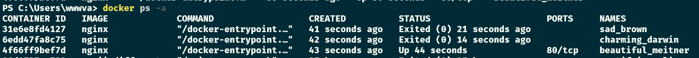

# Exercise 1.1: Getting started

-   Since we already did "Hello, World!" in the material let's do something else.

-   Start 3 containers from an image that does not automatically exit (such as nginx) in detached mode.

-   Stop two of the containers and leave one container running.

-   Submit the output for docker ps -a which shows 2 stopped containers and one running.

Screenshot

