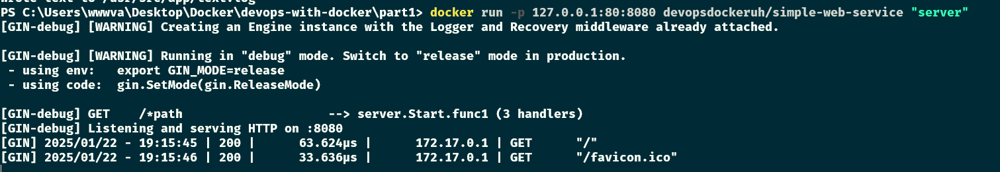
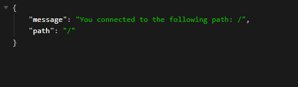

# Exercise 1.10: Ports open

In this exercise, we won't create a new Dockerfile.

The image `devopsdockeruh/simple-web-service` will start a web service in port `8080` when given the argument "server". In Exercise 1.8 you already did an image that can be used to run the web service without any argument.

Use now the -p flag to access the contents with your browser. The output to your browser should be something like: `{ message: "You connected to the following path: ...`

Submit your used commands for this exercise.

<details>
<summary>Commands</summary>

-   `docker run -p 127.0.0.1:80:8080 devopsdockeruh/simple-web-service "server"`

*   go to `localhost:80`

    <details>
    <summary>you should see</summary>

    ```
    {
    "message": "You connected to the following path: /",
    "path": "/"
    }
    ```

    </details>

</details>

<details>
<summary>Screenshots</summary>



</details>
