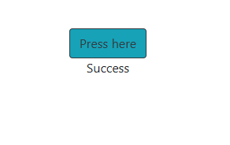

# Exercise 1.11: Spring

Create a Dockerfile for an old Java Spring project that can be found from the course repository.

The setup should be straightforward with the README instructions. Tips to get you started:

There are many options for running Java, you may use eg. amazoncorretto FROM amazoncorretto:_tag_ to get Java instead of installing it manually. Pick the tag by using the README and Docker Hub page.

You've completed the exercise when you see a 'Success' message in your browser.

Submit the Dockerfile you used to run the container.

Commands

-   `docker build -t spring-project .`
-   `docker run -p 127.0.0.1:80:8080 spring-project`

Screenshots

