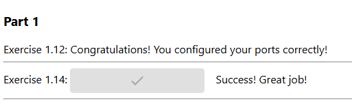

# Mandatory Exercise 1.14: Environment

Start both the frontend and the backend with the correct ports exposed and add ENV to Dockerfile with the necessary information from both READMEs (front, back).

Ignore the backend configurations until the frontend sends requests to _backend_url_/ping when you press the button.

You know that the configuration is ready when the button for 1.14 of frontend responds and turns green.

Do not alter the code of either project

Submit the edited Dockerfiles and commands used to run.

Backend and Frontend

The frontend will first talk to your browser. Then the code will be executed from your browser and that will send a message to the backend.

More information about connection between frontend and backend

TIPS:

When configuring web applications keep the browser developer console ALWAYS open, F12 or cmd+shift+I when the browser window is open. Information about configuring cross-origin requests is in the README of the backend project.
The developer console has multiple views, the most important ones are Console and Network. Exploring the Network tab can give you a lot of information on where messages are being sent and what is received as a response!

Commands

### On the frontend

-   `docker build -t example-frontend .`
-   `docker run -p 127.0.0.1:5000:5000 example-frontend`

### On the backend

-   `docker build -t example-backend .`
-   `docker run -p 127.0.0.1:8080:8080 example-backend`

Screenshots

