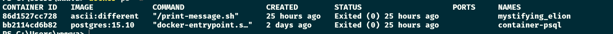

# Exercise 1.2: Cleanup

-   We have containers and an image that are no longer in use and are taking up space. Running docker ps -a and docker image ls will confirm this.

-   Clean the Docker daemon by removing all images and containers.

-   Submit the output for docker ps -a and docker image ls

Screenshot

