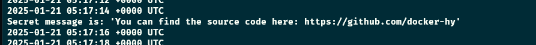

# Exercise 1.3: Secret message

-   Now that we've warmed up it's time to get inside a container while it's running!

-   Image devopsdockeruh/simple-web-service:ubuntu will start a container that outputs logs into a file. Go inside the running container and use tail -f ./text.log to follow the logs. Every 10 seconds the clock will send you a "secret message".

-   Submit the secret message and command(s) given as your answer.

Commands

### In one terminal

-   `docker run -d -it --name simple-web devopsdockeruh/simple-web-service:ubuntu`
-   `docker attach simple-web`

### In another terminal

-   `docker exec -it simple-web bash`
-   `tail -f ./text.log`

Screenshot

