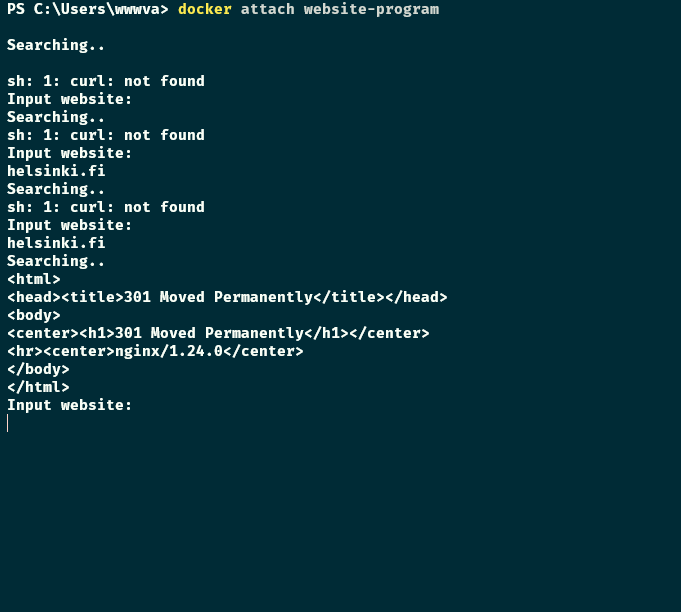

# Exercise 1.4: Missing dependencies

-   Start a Ubuntu image with the process `sh -c 'while true; do echo "Input website:"; read website; echo "Searching.."; sleep 1; curl http://$website; done'`

-   If you're on Windows, you'll want to switch the `'` and `"` around: `sh -c "while true; do echo 'Input website:'; read website; echo 'Searching..'; sleep 1; curl http://$website; done".`

-   You will notice that a few things required for proper execution are missing. Be sure to remind yourself which flags to use so that the container actually waits for input.

    -   Note also that curl is NOT installed in the container yet. You will have to install it from inside of the container.

-   Test inputting `helsinki.fi` into the application. It should respond with something like

```
<html>
  <head>
    <title>301 Moved Permanently</title>
  </head>

  <body>
    <h1>Moved Permanently</h1>
    <p>The document has moved <a href="http://www.helsinki.fi/">here</a>.</p>
  </body>
</html>
```

-   This time return the command you used to start process and the command(s) you used to fix the ensuing problems.

-   Hint for installing the missing dependencies you could start a new process with `docker exec`.

    -   This exercise has multiple solutions, if the curl for helsinki.fi works then it's done. Can you figure out other (smart) solutions?

<details>
<summary>Commands</summary>

### In one terminal

-   `docker run -d -it --name website-program ubuntu sh -c 'while true; do echo "Input website:"; read website; echo "Searching.."; sleep 1; curl http://$website; done'`
-   `docker attach website-program`
-   After installing curl
    -   Input: `helsinki.fi`

### In another terminal

-   `docker exec -it website-program bash`

*   `apt update`
*   `apt install curl`

</details>

<details>
<summary>Screenshot</summary>

</details>
