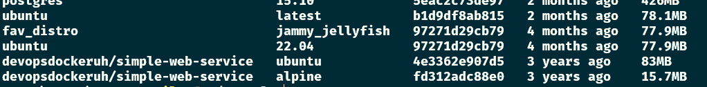
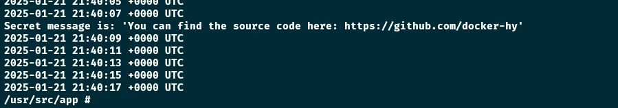

# Exercise 1.5: Sizes of images

-   In the Exercise 1.3 we used `devopsdockeruh/simple-web-service:ubuntu`.

-   Here is the same application but instead of Ubuntu is using Alpine Linux: `devopsdockeruh/simple-web-service:alpine`.

-   Pull both images and compare the image sizes. Go inside the Alpine container and make sure the secret message functionality is the same. Alpine version doesn't have `bash` but it has `sh`, a more bare-bones shell.

Commands

### In one terminal

-   `docker pull devopsdockeruh/simple-web-service:alpine`
-   `docker run -d --name web-service-alpine devopsdockeruh/simple-web-service:alpine`
-   `docker attach web-service-alpine`

### In another terminal

-   `docker exec -it web-service-alpine sh`
-   `tail -f ./text.log`

Screenshots

