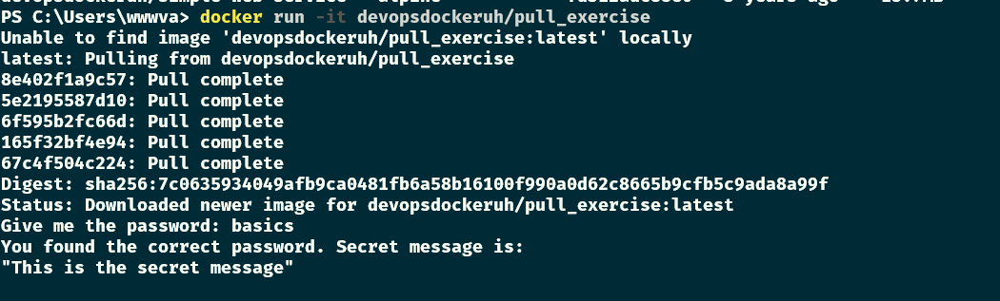

# Exercise 1.6: Hello Docker Hub

-   Run `docker run -it devopsdockeruh/pull_exercise`.

-   The command will wait for your input.

-   Navigate through the Docker hub to find the docs and Dockerfile that was used to create the image.

-   Read the Dockerfile and/or docs to learn what input will get the application to answer a "secret message".

-   Submit the secret message and command(s) given to get it as your answer.

Commands

-   `docker run -it devopsdockeruh/pull_exercise`
-   search up `devopsdockeruh/pull_exercise`
-   input `basics`

Screenshots

