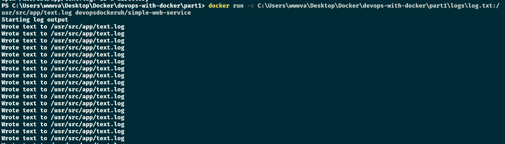

# Exercise 1.9: Volumes

In this exercise we won't create a new Dockerfile.

Image `devopsdockeruh/simple-web-service` creates a timestamp every two seconds to `/usr/src/app/text.log` when it's not given a command. Start the container with a bind mount so that the logs are created into your filesystem.

Submit the command you used to complete the exercise.

Hint: read the note that was made just before this exercise!

Commands

-   Must create `/logs/log.txt` on local machine first
-   `docker run -v "${PWD}/logs/log.txt:/usr/src/app/text.log" devopsdockeruh/simple-web-service`
-   Output: `Secret message is: 'You can find the source code here: https://github.com/docker-hy'`

Screenshots

