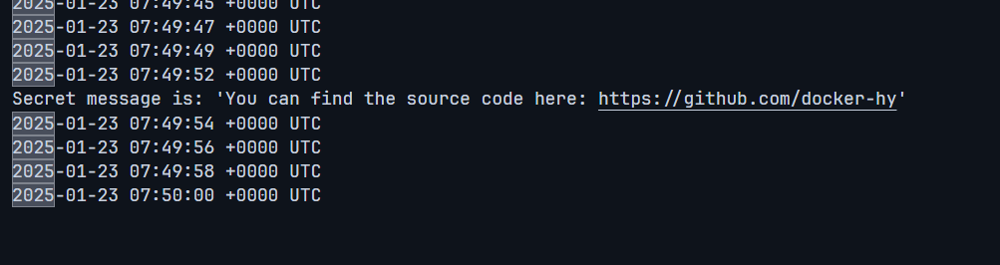

# Exercise 2.1

Let us now leverage the Docker Compose with the simple webservice that we used in the Exercise 1.3

Without a command `devopsdockeruh/simple-web-service` will create logs into its `/usr/src/app/text.log`.

Create a docker-compose.yml file that starts `devopsdockeruh/simple-web-service` and saves the logs into your filesystem.

Submit the docker-compose.yml, and make sure that it works simply by running `docker compose up` if the log file exists.

Commands

-   `docker compose run simple-web-service`

Screenshots

